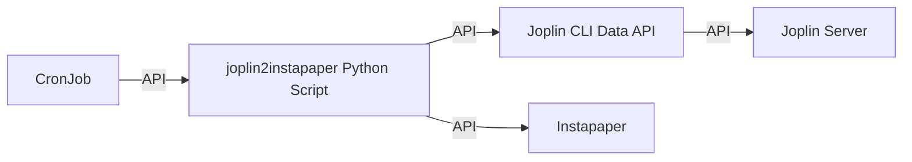
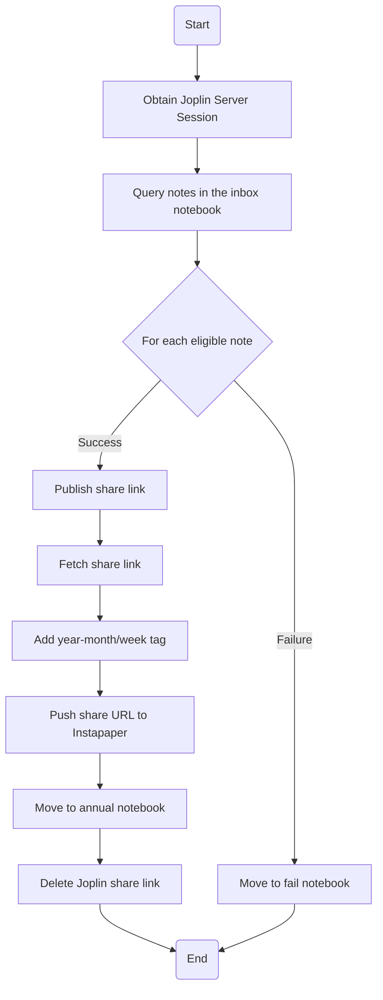

# Publish Joplin Notes to Instapaper for Easy Reading

This project helps you publish your Joplin notes to Instapaper, so you can easily read them on your e-ink reader or other devices.

## Prerequisites

- You must already have a running **Joplin Server**
- You must already have an **Instapaper** account

## Setup Instructions

### 1. Build the Joplin CLI Data API Server

Navigate to the `joplin-cli-server` folder and follow its instructions to set up the Joplin CLI Server.

### 2. Build the `joplin2instapaper` Python Script Docker Image

```
docker build . -t joplin2instapaper:1.0.0
docker run --env-file=.env --rm -it joplin2instapaper:1.0.0 /bin/bash
docker tag joplin2instapaper:1.0.0 localhost:32000/joplin2instapaper:1.0.0
docker push localhost:32000/joplin2instapaper:1.0.0
docker compose build
docker compose up
```

### 3. Create the `joplin2instapaper` CronJob on Kubernetes

```
kubectl apply -f joplin2instapaper-*.yaml
kubectl get cronjob -n joplin-cli
kubectl describe cronjob joplin2instapaper-cron -n joplin-cli
```

## Notes

- Make sure to set up all necessary environment variables in your `.env` file as required by your setup.

---

Feel free to suggest improvements or ask questions by opening an issue in this repository!

---

## Architecture Diagram



## Flowchart



### Process Description

1. When started, environment variables are used to configure Joplin and Instapaper API endpoints.
2. A session is established with the Joplin Server.
3. Notes created recently in the specified notebook (e.g., "inbox") are queried (with time filters).
4. For each note:
    - Publish a Joplin share link.
    - Fetch the share URL.
    - Add a year-month/week tag in Joplin.
    - Push the share URL to Instapaper.
    - On success, move the note to the annual notebook; on failure, move to the fail notebook.
    - Delete the Joplin share link to avoid duplication.
5. The entire process is triggered automatically and periodically by a Kubernetes CronJob, ensuring consistent synchronization.

---
